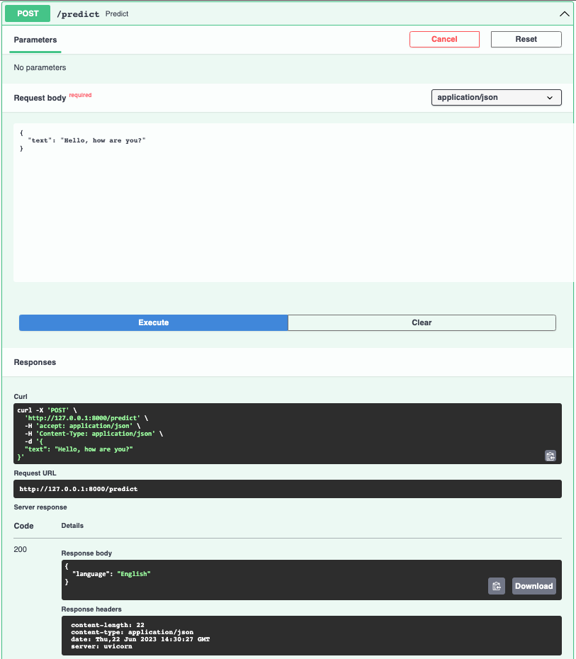
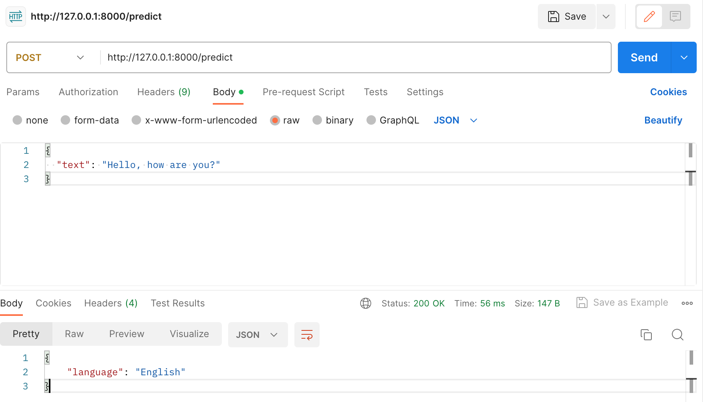

# Language Detection App
## 1. What it is
This is a web app that identifies what language a text input is written in.
https://github.com/mkang32/language-detection-app/assets/26635198/485628ee-2dd3-4de1-97da-3869031d42d9

This repo consists of two parts: the RESTful API service (`app-api`) and the Streamlit frontend (`app-frontend`). The Streamlit frontend makes API requests to get language predictions and visualize the results. 

## 2. How to run the app
### 2.1. Setting the local environment
As there are two services running separately, you will need to create two environments.

#### app-api
Create a virtual environment
```bash
cd app-api
python3 -m venv venv-language-detection-api
```
Activate the virtual environment 
```bash
source venv-language-detection-api/bin/activate
```
Install requirements
```bash
pip install -r requirements.txt
```

#### app-frontend
Create a virtual environment
```bash
cd app-frontend
python3 -m venv venv-language-detection-frontend
```
Activate the virtual environment 
```bash
source venv-language-detection-frontend/bin/activate
```
Install requirements
```bash
pip install -r requirements.txt
```


### 2.2. Spin up the API service
Run this in your terminal:
```bash
cd app-api
uvicorn main:app --reload
```

### 2.3. Open the streamlit app
Open another terminal and run the following command. 
```bash
cd app-frontend
streamlit run main.py
```
You will be able to see the web app in your broswer at this URL:
```http://localhost:8501```


## 3. ML model
The model is based on [this tutorial](https://github.com/AssemblyAI-Examples/ml-fastapi-docker-heroku). Also, check out more details about the ML model in this [Google Colab](https://colab.research.google.com/drive/1uaALcaatvxOu42IhQA4r0bahfdpw-Z7v?usp=sharing).

1. Dataset   
It uses this [Kaggle Language Detection dataset](https://www.kaggle.com/datasets/basilb2s/language-detection) in a csv file, which contains 17 languages.
   ```text
   ['Arabic', 'Danish', 'Dutch', 'English', 'French', 'German',
    'Greek', 'Hindi', 'Italian', 'Kannada', 'Malayalam', 'Portugeese',
    'Russian', 'Spanish', 'Sweedish', 'Tamil', 'Turkish']
   ```

2. Pre-processing  
It only takes letters by removing any numbers or special characters using Python built-in regex function.
   ```python
    text = re.sub(r'[!@#$(),\n"%^*?\:;~`0-9]', ' ', text)
    text = re.sub(r'[[]]', ' ', text)
    text = text.lower()
   ```

    Then, vectorize the texts using `CountVectorizer`.
    ```python
    from sklearn.feature_extraction.text import CountVectorizer
    cv = CountVectorizer()
    cv.fit(X_train)
    
    x_train = cv.transform(X_train).toarray()
    x_test  = cv.transform(X_test).toarray()
    ```

3. Model  
Build a classifier using `MultinomialNB`.
   ```python
   from sklearn.naive_bayes import MultinomialNB

    model = MultinomialNB()
    model.fit(x_train, y_train)
   ```
   
4. Model export 
Export the model file as a pickle file.
   ```python
    with open('trained_pipeline-0.1.0.pkl','wb') as f:
        pickle.dump(pipe, f)
    ```

## 4. API Development
In this app, the model is exposed as APIs using FastAPI. Check out `app/main.py`. The main two API end points are as below:

```python
@app.get("/")
def home():
    return {"health_check": "OK", "model_version": model_version}


@app.post("/predict", response_model=PredictionOut)
def predict(payload: TextIn):
    language, prob = predict_pipeline(payload.text)
    return {"language": language, "probability": prob}
```

### 4.1. Run the app locally
For development, make sure the local environment is set up as described in the section 2. How to run the app. 

When running this in your terminal `uvicorn app.main:app --reload`, you will see something like
```bash
INFO:     Uvicorn running on http://127.0.0.1:8000 (Press CTRL+C to quit)
```
Copy and paste the ULR to your browser. You will see the health check API results.
Note that you cannot test your POST request in your browser because browsers can only handle GET requests.

### 4.2. Test your API in Swagger 
Go to `http://127.0.0.1:8000/docs` and test the end points.
- Click POST `/predict` endpoint 
- Click the 'Try it out' button
- Add a JSON input to Request body
```json
{
  "text": "Hello, how are you?"
}
```
- Click the Execute button


### 4.3. Test your API with Postman
Open up Postman and test the end points. 
- Change the request type to POST
- Add a JSON input to the Body
```json
{
  "text": "Hello, how are you?"
}
```
- Click Send
- Check out the response



### 4.4. Dockerize the API
Build a Docker image. This may take a few minutes.
```bash
docker build -t language-detection-api .
```

Start the Docker Container with the following command
```bash
docker run -d --name language-detection-api -p 80:80 language-detection-api
```

Go to swagger (http://0.0.0.0/docs) or use Postman to test out the endpoints in your dockerized app. Use the same steps above but with the replaced url (http://0.0.0.0:80).

Make sure to remove the container when you rebuild and run a new container with the same name.

Check container id: 
```bash
docker ps 
```
Stop the docker container
```bash
docker stop {container_id}
```

Remove the container: 
```bash
docker rm {container_id}
```

## 5. Frontend
The frontend of the app is developed in Streamlit. It makes an API request with the given input text and visualize in the browser.

Note that right now, the endpoint points to local host. If the API is deployed to a web server, update the URL. 
```python
# make prediction on click
if st.button("Predict :sunglasses:"):
    res = requests.post(url="http://127.0.0.1:8000/predict", data=json.dumps({"text": text}))
    res = res.json()
    st.subheader(f"**{res.get('language')}** with the probability of **{res.get('probability')}**")
```

### Running the frontend locally


### Frontend dockerization
Go to `app-frontend` folder and build a Docker image. This may take a few minutes.
```bash
cd app-frontend
docker build -t language-detection-frontend .
```

Start the Docker Container with the following command
```bash
docker run -p 8501:8501 language-detection-frontend
```

Run the container by executing:
```bash
docker run -p 8501:8501 language-detection-frontend
```

You should see the output similar to the following:
```bash

Collecting usage statistics. To deactivate, set browser.gatherUsageStats to False.


  You can now view your Streamlit app in your browser.

  URL: http://0.0.0.0:8501
```

Note that you may need to change API_URL in `app-frontend/settings.py` depending on how the API service is run. By default, the streamlit app assumes it is running from the docker container (http://0.0.0.0).  

## Others
Frontend photo credit: [Towfiqu barbhuiya](https://unsplash.com/@towfiqu999999?utm_source=unsplash&utm_medium=referral&utm_content=creditCopyText) on Unsplash

# Reference
* [AssemblyAI Example "ml-fastapi-docker-heroku"](https://github.com/AssemblyAI-Examples/ml-fastapi-docker-heroku)
* [Paul Iusztin's "The Full Stack 7-Steps MLOps Framework](https://github.com/iusztinpaul/energy-forecasting)
