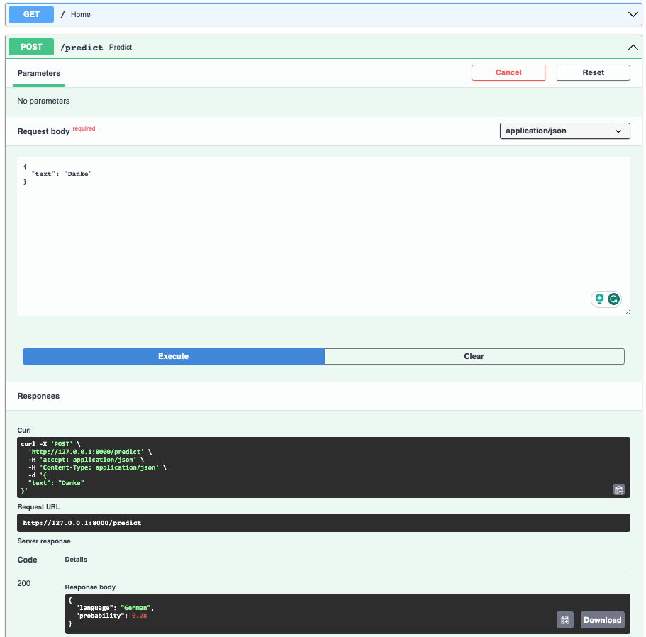

# Language Detection App
## What it is
This is a language detection model API developed
based on this tutorial [AssemblyAI-Examples/ml-fastapi-docker-heroku](https://github.com/AssemblyAI-Examples/ml-fastapi-docker-heroku).

You can get send an API request with a text input and it will return which language it is. 

The machine learning model is developed in [Google Colab](https://colab.research.google.com/drive/1uaALcaatvxOu42IhQA4r0bahfdpw-Z7v?usp=sharing) and this app uses the developed model and expose it as API. The app is hosted on Heroku so it can be reached from anywhere by anyone.

## Local Development
### Setting the local environment
Create a virtual environment
```bash
python3 -m venv venv-language-detection
```
Activate the virtual environment 
```bash
source venv-language-detection/bin/activate
```
Install requirements
```bash
pip install -r requirements.txt
```

### Run the app locally
Run this in your terminal:
```bash
uvicorn app.main:app --reload
```
You will see something like
```bash
INFO:     Uvicorn running on http://127.0.0.1:8000 (Press CTRL+C to quit)
```
Then copy and paste the ULR to your browser. You will see the health check API results.
Note that you cannot test your POST request in your browser because browsers can only handle GET requests.

### Test your API in Swagger 
Go to `http://127.0.0.1:8000/docs` and test the end points.
- Click POST `/predict` endpoint 
- Click the 'Try it out' button
- Add a JSON input to Request body
```json
{
  "text": "Hello, how are you?"
}
```
- Click the Execute button


### Test your API with Postman
Open up Postman and test the end points. 
- Change the request type to POST
- Add a JSON input to the Body
```json
{
  "text": "Hello, how are you?"
}
```
- Click Send
- Check out the response


### Building Docker
Build a Docker image. This may take a few minutes.
```bash
docker build -t language-detection .
```

Start the Docker Container with the following command
```bash
docker run -d --name language-detection -p 80:80 language-detection
```

Go to swagger (http://0.0.0.0/docs) or use Postman to test out the endpoints in your dockerized app. Use the same steps above but with the replaced url (http://0.0.0.0:80).

Make sure to remove the container when you rebuild and run a new container with the same name.

Check container id: 
```bash
docker ps 
```

Remove the container: 
```bash
docker rm {container_id}
```

## Deploy to Heroku
