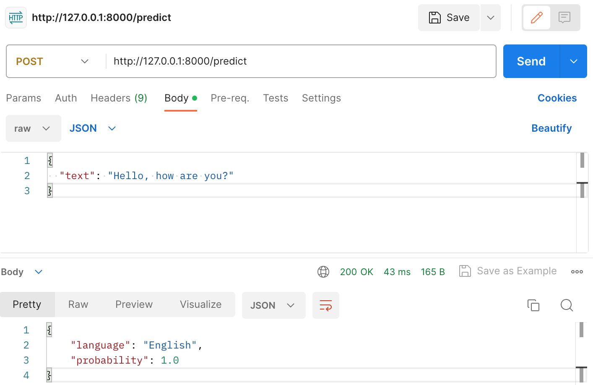

# Language Detection App
## 1. What it is
This is a language detection model API developed
based on this tutorial ([AssemblyAI-Examples/ml-fastapi-docker-heroku](https://github.com/AssemblyAI-Examples/ml-fastapi-docker-heroku)).

You can get send an API request with a text input and it will return which language it is. 

## 2. ML model
The machine learning model development work is documented here in [Google Colab](https://colab.research.google.com/drive/1uaALcaatvxOu42IhQA4r0bahfdpw-Z7v?usp=sharing).

1. Dataset   
It uses this [Kaggle Language Detection dataset](https://www.kaggle.com/datasets/basilb2s/language-detection) in a csv file, which contains 17 languages.
   ```text
   ['Arabic', 'Danish', 'Dutch', 'English', 'French', 'German',
    'Greek', 'Hindi', 'Italian', 'Kannada', 'Malayalam', 'Portugeese',
    'Russian', 'Spanish', 'Sweedish', 'Tamil', 'Turkish']
   ```

2. Pre-processing  
It only takes letters by removing any numbers or special characters using Python built-in regex function.
   ```python
    text = re.sub(r'[!@#$(),\n"%^*?\:;~`0-9]', ' ', text)
    text = re.sub(r'[[]]', ' ', text)
    text = text.lower()
   ```

    Then, vectorize the texts using `CountVectorizer`.
    ```python
    from sklearn.feature_extraction.text import CountVectorizer
    cv = CountVectorizer()
    cv.fit(X_train)
    
    x_train = cv.transform(X_train).toarray()
    x_test  = cv.transform(X_test).toarray()
    ```

3. Model  
Build a classifier using `MultinomialNB`.
   ```python
   from sklearn.naive_bayes import MultinomialNB

    model = MultinomialNB()
    model.fit(x_train, y_train)
   ```
   
4. Model export 
Export the model file as a pickle file.
   ```python
    with open('trained_pipeline-0.1.0.pkl','wb') as f:
        pickle.dump(pipe, f)
    ```

## 3. API Development
### 3.1. Setting the local environment
Create a virtual environment
```bash
python3 -m venv venv-language-detection
```
Activate the virtual environment 
```bash
source venv-language-detection/bin/activate
```
Install requirements
```bash
pip install -r requirements.txt
```

### 3.2. Work on the app
Expose the predict function as a POST API using FastAPI. Check out `app/main.py`

### 3.3. Run the app locally
Run this in your terminal:
```bash
uvicorn app.main:app --reload
```
You will see something like
```bash
INFO:     Uvicorn running on http://127.0.0.1:8000 (Press CTRL+C to quit)
```
Then copy and paste the ULR to your browser. You will see the health check API results.
Note that you cannot test your POST request in your browser because browsers can only handle GET requests.

### 3.4. Test your API in Swagger 
Go to `http://127.0.0.1:8000/docs` and test the end points.
- Click POST `/predict` endpoint 
- Click the 'Try it out' button
- Add a JSON input to Request body
```json
{
  "text": "Hello, how are you?"
}
```
- Click the Execute button


### 3.5. Test your API with Postman
Open up Postman and test the end points. 
- Change the request type to POST
- Add a JSON input to the Body
```json
{
  "text": "Hello, how are you?"
}
```
- Click Send
- Check out the response



## 4. Dockerize
Build a Docker image. This may take a few minutes.
```bash
docker build -t language-detection .
```

Start the Docker Container with the following command
```bash
docker run -d --name language-detection -p 80:80 language-detection
```

Go to swagger (http://0.0.0.0/docs) or use Postman to test out the endpoints in your dockerized app. Use the same steps above but with the replaced url (http://0.0.0.0:80).

Make sure to remove the container when you rebuild and run a new container with the same name.

Check container id: 
```bash
docker ps 
```

Remove the container: 
```bash
docker rm {container_id}
```

## 5. Deployment
You can now deploy this to any web server like Heroku. To do that, add heroku.yml and use heroku cli. 